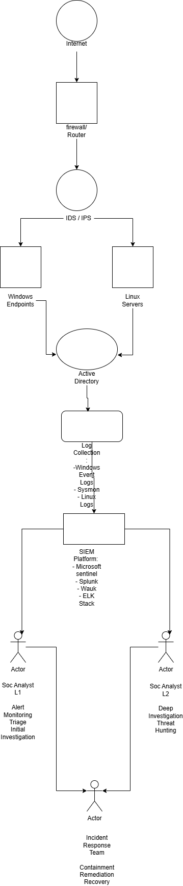

#  SOC Fundamentals - Security Operations Center Overview


## Table of Contents

- [Project Overview](#project-overview)
- [Project Scope](#project-scope)
- [Objectives](#objectives)
- [What is a SOC?](#what-is-a-soc)
- [SOC Analyst Responsibilities](#soc-analyst-responsibilities)
- [SOC Technologies](#soc-technologies)
- [SOC Incident Workflow](#soc-incident-workflow)
- [SOC Architecture](#soc-architecture)
- [Frameworks](#frameworks)
- [Skills Demonstrated](#skills-demonstrated)
- [Future Improvements](#future-improvements)
- [Learning Outcomes](#learning-outcomes)
- [Author](#author)


This project is the first module of my SOC Analyst Portfolio.

It introduces the core concepts of Security Operations Centers (SOC), including analyst roles, monitoring workflows, incident response, and the technologies used to detect and respond to cyber threats.

The knowledge presented here serves as the foundation for the hands-on SOC investigations and SIEM laboratories developed throughout this portfolio.

##  Project Overview

This project provides an overview of a Security Operations Center (SOC), its architecture, responsibilities, processes and the role of SOC analysts in detecting and responding to cyber threats.


## Project Scope

This project introduces the fundamental concepts of Security Operations Centers (SOC). It covers the responsibilities of SOC analysts, the SOC architecture, security monitoring workflows, incident response processes, and the technologies commonly used by Blue Teams.

The project serves as the foundation for future hands-on SOC investigations included in this portfolio.


##  Objectives

The objectives of this project are:

- Understand the role of a SOC
- Explain SOC analyst responsibilities
- Describe SOC architecture components
- Understand security monitoring workflow
- Document incident response lifecycle


##  What is a SOC?

A Security Operations Center (SOC) is a centralized team responsible for monitoring, detecting, analyzing and responding to cybersecurity incidents.

A SOC operates continuously to identify suspicious activities and protect organizational assets.


##  SOC Analyst Responsibilities

### SOC Analyst Level 1 (L1)

Main responsibilities:

- Monitor security alerts
- Analyze logs
- Validate incidents
- Perform initial investigation
- Escalate critical events


### SOC Analyst Level 2 (L2)

Responsibilities:

- Deep investigation
- Threat hunting
- Malware analysis
- Incident containment


### SOC Analyst Level 3 (L3)

Responsibilities:

- Advanced threat analysis
- Detection engineering
- Security architecture improvement
- Threat intelligence


## SOC Technologies

| Category | Technologies |
|----------|--------------|
| SIEM | Microsoft Sentinel, Splunk, Wazuh, ELK Stack |
| Endpoint Security | Microsoft Defender, CrowdStrike, SentinelOne, Sysmon |
| Network Security | Firewalls, IDS/IPS, Wireshark |
| Frameworks | MITRE ATT&CK, Cyber Kill Chain, NIST Incident Response Lifecycle |

##  SOC Incident Workflow


```text
Alert Generation
        │
        ▼
 Alert Triage
        │
        ▼
 Investigation
        │
        ▼
 Classification
        │
        ▼
 Containment
        │
        ▼
 Remediation
        │
        ▼
 Lessons Learned
```
## SOC Architecture

The following diagram represents a Security Operations Center architecture, including security data sources, log collection, SIEM platform, SOC analysts and incident response workflow.



##  Frameworks

This project references:

- MITRE ATT&CK Framework
- Cyber Kill Chain
- Incident Response Lifecycle


##  Skills Demonstrated

✔ SOC Operations  
✔ Security Monitoring  
✔ Incident Management  
✔ Cybersecurity Documentation  
✔ Blue Team Fundamentals  


##  Future Improvements

This project will be extended with:

- SIEM laboratory
- Real log analysis
- Threat detection rules
- Incident investigation reports


## Learning Outcomes

After completing this project, I am able to:

- Explain the role of a Security Operations Center (SOC)
- Describe the responsibilities of SOC L1, L2 and L3 analysts
- Understand the incident response lifecycle
- Identify the main technologies used in a SOC
- Understand the security monitoring workflow
- Apply cybersecurity frameworks such as MITRE ATT&CK and the NIST Incident Response Lifecycle


  ## Author

**Aurole Sopdong Makeufouet Mbakou**

Cybersecurity Professional

Focus Areas

- Security Operations Center (SOC)
- Threat Detection
- Incident Response
- SIEM
- Blue Team
- Identity & Access Management

GitHub:
https://github.com/Aurolembakou
