# SOC Home Lab

## Project Overview

This project documents the design and implementation of a virtual Security Operations Center (SOC) laboratory.

The lab is being built to develop hands-on experience in security monitoring, log collection, threat detection, incident investigation, and SIEM administration.

## Lab Environment

| System | Operating System | Role | IPv4 | Status |
|---|---|---|---|---|
| SIEM1 | Windows Server 2022 Standard | SIEM Server | `10.10.1.22/24` | ✅ Configured |
| Windows2019 | Windows Server 2019 | Windows Lab Server | `10.10.1.19/24` | ✅ Configured |
| Windows11 | Windows 11 | Endpoint Workstation | `10.10.1.11/24` | ✅ Configured |

**Virtualization platform:** VMware Workstation Pro 26H1  
**Default gateway:** `10.10.1.1`  
**DNS server:** `8.8.8.8`

---
## Current Lab Architecture

```text
                                              SOC Home Lab
                              |
                     VMware Workstation Pro
                              |
                        10.10.1.0/24
                /             |             \
               /              |              \
            SIEM1        Windows2019       Windows11
       Windows Server    Windows Server     Windows 11
            2022              2019           Endpoint
         10.10.1.22        10.10.1.19      10.10.1.11
               \
                \
                SIEM2
              Windows 11
          Secondary SIEM
             10.10.1.18
```

> The environment is being built progressively. SIEM integration, centralized log collection, detection rules, and attack simulations will be documented in later phases.

---

## Phase 1 - SIEM1 Deployment and Configuration

The first phase of the SOC lab consisted of deploying and preparing the Windows Server that will support the SIEM environment.

### Tasks Completed

- Deployed the SIEM1 virtual machine
- Installed Windows Server 2022
- Configured a static IPv4 address
- Configured the default gateway and DNS server
- Installed VMware Tools
- Verified the VMware Tools service using PowerShell
- Prepared SIEM1 for the next phases of the SOC environment

### SIEM1 - Windows Server 2022

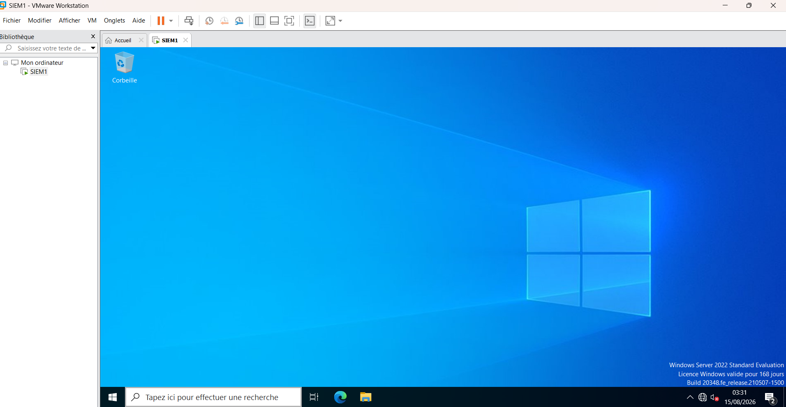

SIEM1 is deployed as a Windows Server 2022 virtual machine running on VMware Workstation Pro.

### Network Configuration

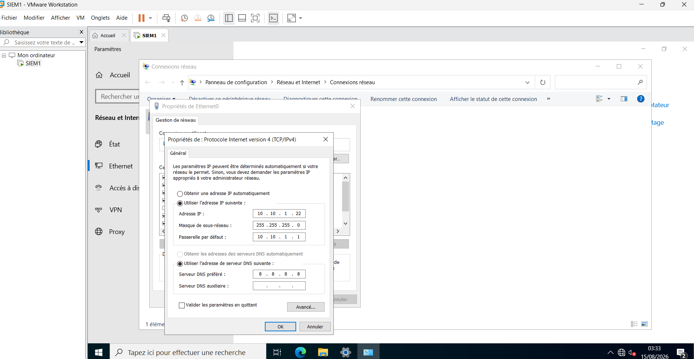

SIEM1 uses a static IPv4 configuration to provide a consistent network address for communication and future security log collection within the SOC lab.

**Network configuration:**

- Hostname: `SIEM1`
- IPv4: `10.10.1.22`
- Subnet mask: `255.255.255.0`
- Default gateway: `10.10.1.1`
- DNS: `8.8.8.8`

### VMware Tools Verification

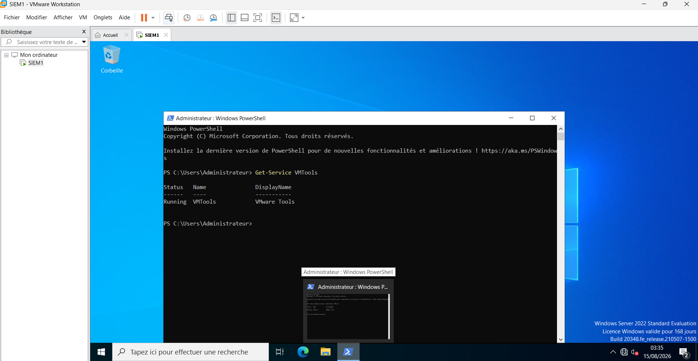

VMware Tools was verified from PowerShell using:

`Get-Service VMTools`

The service returned a `Running` status, confirming that VMware Tools is operational.

### Phase 1 Status

**SIEM1 Deployment and Initial Configuration: Completed**

---

## Phase 2 - Windows Server 2019 Deployment and Configuration

The second phase of the SOC lab consisted of deploying and configuring an additional Windows Server 2019 virtual machine.

This system will be used as part of the lab infrastructure for future security monitoring, log collection, and investigation activities.

### Tasks Completed

- Created the Windows Server 2019 virtual machine
- Installed Windows Server 2019
- Renamed the system to `Windows2019`
- Configured a static IPv4 address
- Configured the default gateway and DNS server
- Installed VMware Tools
- Verified the VMware Tools service using PowerShell
- Disabled automatic Server Manager launch at logon
- Installed available Windows updates
- Prepared the system for integration into the SOC lab

### Windows Server 2019 Deployment

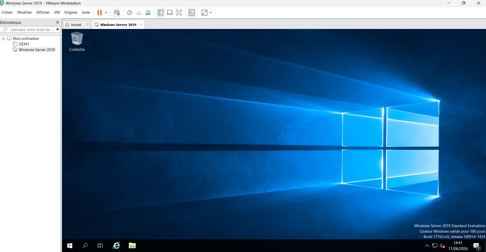

The `Windows2019` virtual machine was successfully deployed using VMware Workstation Pro.

### Network Configuration

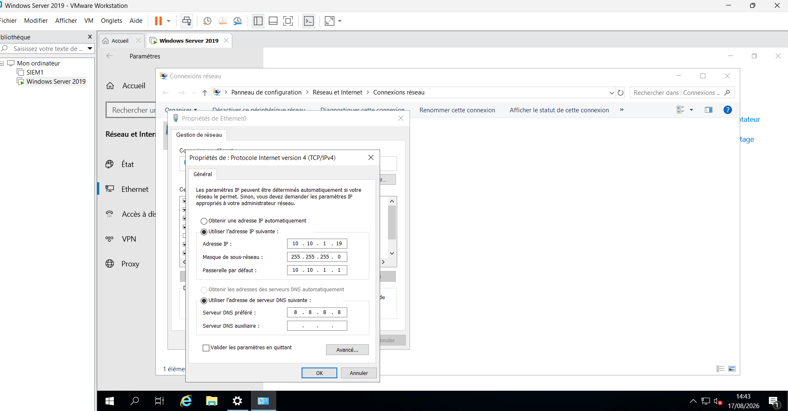

A static IPv4 configuration was assigned to maintain consistent communication with the other systems in the SOC lab.

**Network configuration:**

- Hostname: `Windows2019`
- IPv4: `10.10.1.19`
- Subnet mask: `255.255.255.0`
- Default gateway: `10.10.1.1`
- DNS: `8.8.8.8`

### VMware Tools Verification

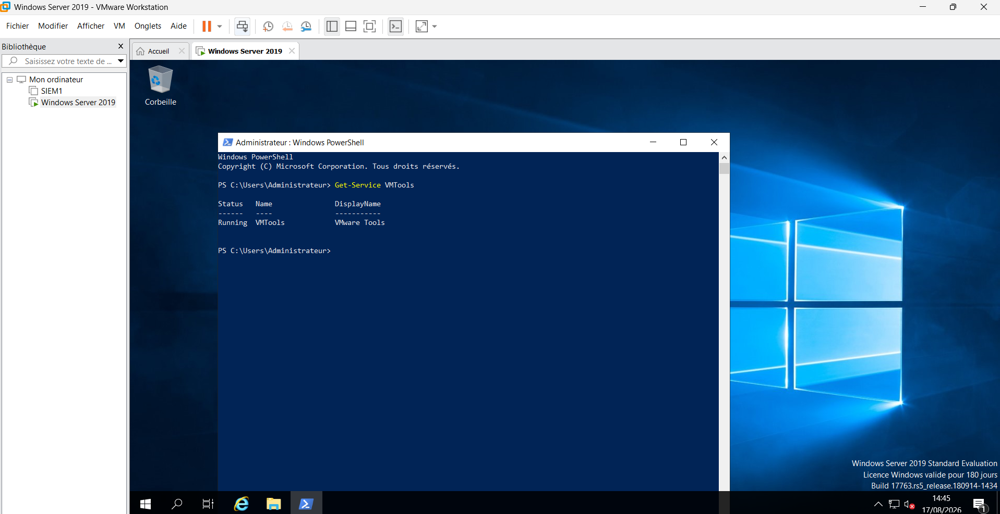

VMware Tools was verified using PowerShell:

`Get-Service VMTools`

The `Running` status confirms that the VMware Tools service is operational.

### Phase 2 Status

**Windows Server 2019 Deployment and Initial Configuration: Completed**

---

## Lab Progress

| Phase | Description | Status |
|---|---|---|
| Phase 1 | SIEM1 - Windows Server 2022 deployment | ✅ Completed |
| Phase 2 | Windows Server 2019 deployment | ✅ Completed |
| Phase 3 | Windows 11 endpoint deployment | ✅ Completed |
| Phase 4 | SIEM2 - Windows 11 deployment | ✅ Completed |
| Phase 5 | Next SOC lab component | ⏳ Upcoming |

## Skills Demonstrated

- VMware Workstation Pro administration
- Windows Server 2019 and 2022 deployment
- Virtual machine configuration
- Static IPv4 network configuration
- Windows Server administration
- VMware Tools installation and verification
- PowerShell service validation
- SOC lab infrastructure design
- Technical documentation with Git and GitHub

## Next Steps

The environment will be expanded progressively as the SOC lab develops.

Planned activities include:

- Centralized log collection
- SIEM integration
- Security monitoring
- Detection engineering
- Incident investigation
- Attack simulation

> This repository documents the lab as it is built. Screenshots and configurations are included as evidence of hands-on implementation.

---

## Phase 3 - Windows 11 Deployment and Configuration

The third phase of the SOC lab consisted of deploying and configuring a Windows 11 workstation that will act as an endpoint within the lab environment.

This system will later be used for security monitoring, log generation, threat detection, and incident investigation activities.

### Tasks Completed

- Created the Windows 11 virtual machine
- Installed and completed the initial Windows 11 configuration
- Configured a static IPv4 address
- Configured the default gateway and DNS server
- Installed VMware Tools
- Verified the VMware Tools service using PowerShell
- Prepared the workstation for integration into the SOC lab

### Windows 11 Deployment

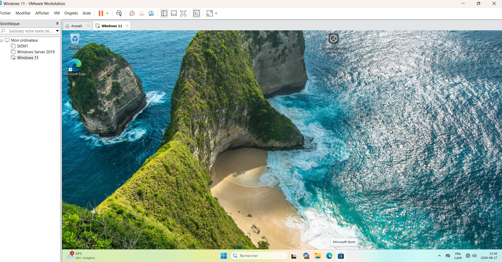

The Windows 11 virtual machine was successfully deployed using VMware Workstation Pro.

### Network Configuration

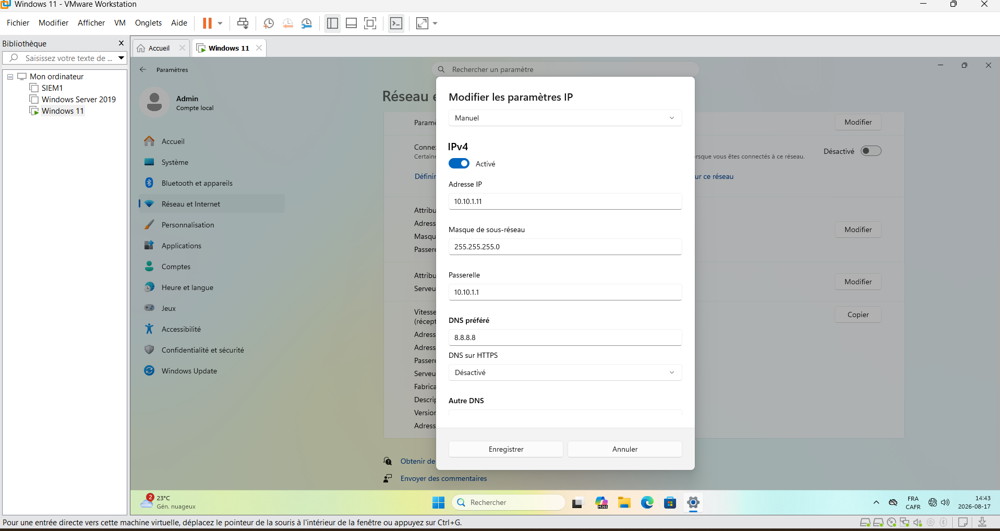

A static IPv4 configuration was assigned to provide consistent communication with the other systems in the SOC lab.

**Network configuration:**

- IPv4: `10.10.1.11`
- Subnet mask: `255.255.255.0`
- Default gateway: `10.10.1.1`
- DNS: `8.8.8.8`

### VMware Tools Verification

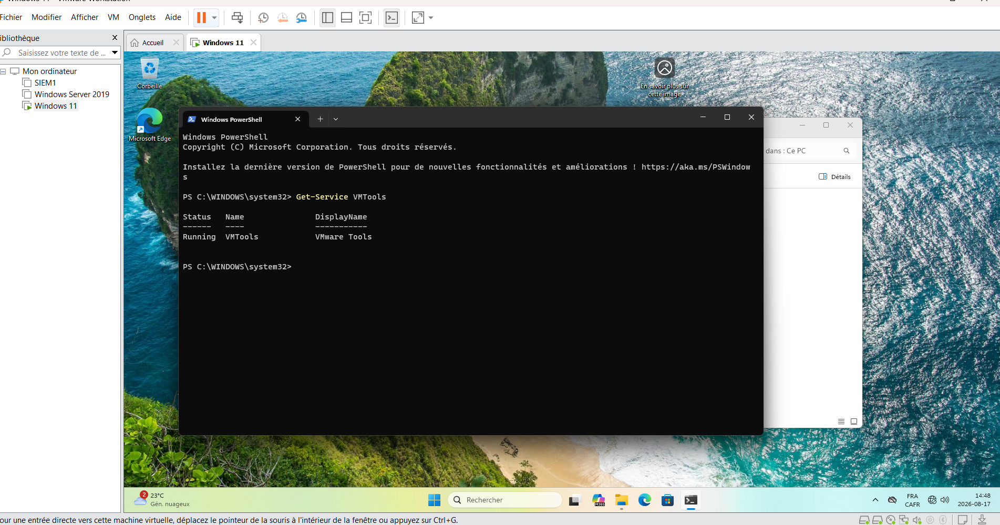

VMware Tools was verified using PowerShell:

`Get-Service VMTools`

The `Running` status confirms that the VMware Tools service is operational.

### Phase 3 Status

**Windows 11 Deployment and Initial Configuration: Completed**

---

## Phase 4 - SIEM2 Deployment and Configuration

The fourth phase of the SOC lab consisted of deploying and configuring an additional Windows 11 virtual machine named `SIEM2`.

This system expands the SOC lab infrastructure and will be used in future phases for security monitoring, SIEM-related activities, log collection, threat detection, and incident investigation.

### Tasks Completed

- Created the SIEM2 virtual machine
- Installed and completed the initial Windows 11 configuration
- Renamed the system to `SIEM2`
- Configured the network settings
- Installed VMware Tools
- Verified the VMware Tools service using PowerShell
- Prepared SIEM2 for integration into the SOC lab

### SIEM2 Deployment


The SIEM2 Windows 11 virtual machine was successfully deployed using VMware Workstation Pro.

### Network Configuration

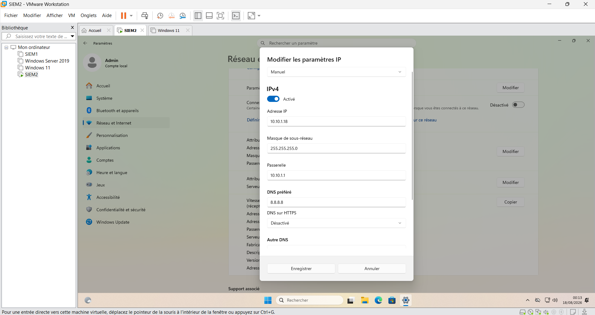

A static IPv4 configuration was assigned to provide consistent communication with the other systems in the SOC lab.

**Network configuration:**

- Hostname: `SIEM2`
- IPv4: `10.10.1.18`
- Subnet mask: `255.255.255.0`
- Default gateway: `10.10.1.1`
- DNS: `8.8.8.8`### VMware Tools Verification

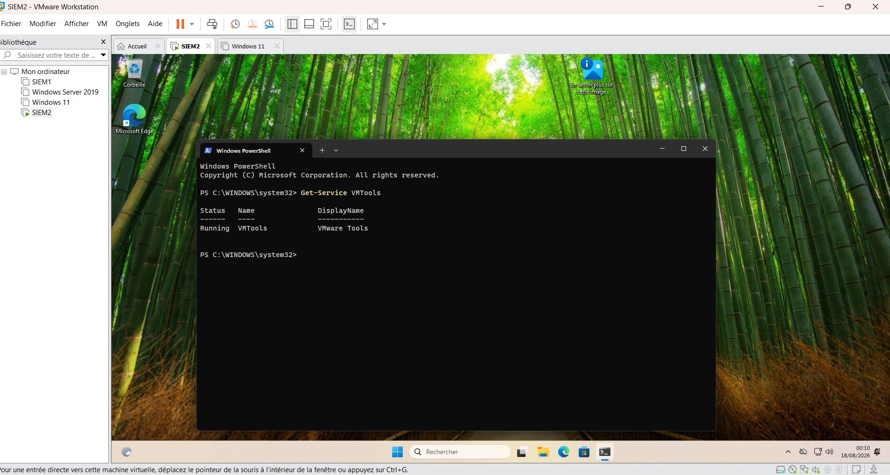

VMware Tools was verified using PowerShell:

`Get-Service VMTools`

The `Running` status confirms that the VMware Tools service is operational.

### Phase 4 Status

**SIEM2 Deployment and Initial Configuration: Completed**


